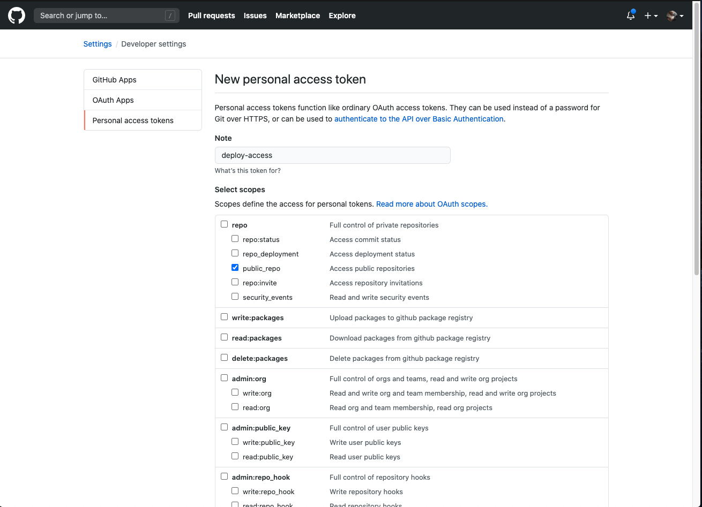

# ui-todo

This project was bootstrapped with [Create React App](https://github.com/facebook/create-react-app).

## Before we start

Make sure you have the following accounts:

- [Firebase](https://firebase.google.com/)
- [Github](https://github.com/)

Make sure you have the following installed in your computer:

- Git ([instructions here](https://git-scm.com/book/en/v2/Getting-Started-Installing-Git))
- NPM ([instructions here](https://www.npmjs.com/get-npm))
- Your preferred IDE/editor (if not, you may try [VSCode](https://code.visualstudio.com/) out)

## Setting up

1. Fork this repo
2. Clone your forked repo to your preferred directory in your computer
3. Open the repo in your IDE/editor

## Development

### Install dependencies

```
npm ci
```

### Run app in development mode

```
npm run start
```

- Open [http://localhost:3000](http://localhost:3000) to view it in the browser.
- The page will reload if you make edits.<br />
- You will also see any lint errors in the console.

### Run unit tests

```
npm run test
```

### Run e2e tests

```
npm run start           # if you have not already done so
npm run cypress:open
```

An interactive window will appear. Click on the test you want to run.

## Deployment

test test

### Github Pages

Github Pages is a static site hosting service that takes HTML, CSS and Javascript files from a repository on Github and publishes a website. Before we start, we have to fork the repository so that we can host the application on our site. After forking, click on the _Actions_ tab and enable workflows to run on the forked repositroy

The URL to your Github page should be: _https://\<your-github-username\>.github.io/ui-todo_

**Manual Deployment**

No configuration is required. Run the following and see your changes go live on your Github page

```
npm run deploy
```

**Automatic Deployment**

**Step 1**: Create a new personal access code to allow Github actions to deploy on our behalf

- Go to personal profile setting and on the left navbar, click on _Developer settings_
- Again on the left navbar, click on _Personal access tokens_
- On the top, click on _Generate new token_
- Under _Note_, fill it up with the purpose of the token (e.g. 'deploy-access') and under _Select scopes_, tick the checkbox _public_repo_ and finally click _Generate token_
- Save the access token somewhere



**Step 2**: Add access token to project’s environment variables

- Go to project setting and on the left navbar, click on _Secrets_
- On the top, click on _New secret_
- Under _Name_, enter ‘DEPLOY*ACCESS_TOKEN’ and under \_Value*, key in the access token you have saved earlier


**Step 3**: You are done! :tada: You can now commit and see your changes applied on your Github page
